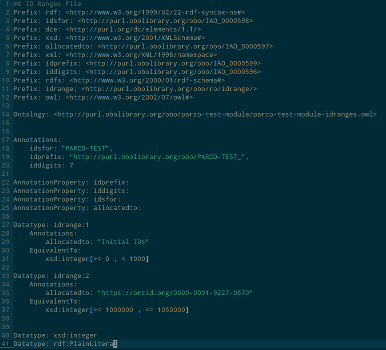

# How to Use Git to Interact with a PARC Module

If you're working with the Ontology Development Kit (ODK), you may need to interact with a module that has been implemented using the Protégé OWL Reasoner and Classifier (PARC). Git is a powerful version control system that can help you manage changes to the code and track the history of your work.

In this worksheet, we'll walk you through the basic steps of using Git to interact with a PARC module. By the end of this worksheet, you should have a basic understanding of how to use Git to manage your ODK projects.

# Setting Up As A New Contributor

## Cloning the Repository

If you're starting from scratch, the first thing you'll need to do is clone the repository containing the PARC module you want to work with. To do this, navigate to the repository on GitHub and click the "Clone or download" button.

You can then copy the repository's URL from the box that appears.

Once you've copied the URL, you can use the `git clone` command to clone the repository to your local machine. For example, to clone the `parc-test-module` repository from the `eu-parc` organization on GitHub, you would run the following command in your terminal:

```bash
git clone <https://github.com/eu-parc/parc-test-module.git>
```

This will create a new directory on your local machine with the same name as the repository (`parc-test-module` in this case) and download the contents of the repository into that directory.

## Developing in a branch

If you are new to ODK, ontologies, or git, or if you are planning a lot of work at once that may conflict with other work on-going in the ontology, you may want to develop your changes in a branch. You can then later make a pull request to request that your changes be imported into the main ontology.

## Setting up an idrange

The `parco-test-module-idranges.owl` file is used to manage the identifiers used in the ontology. Each editor is assigned a range of numerical IDs that they should use to provision new terms. These are defined to avoid 

To add your own entry to the `parco-test-module-idranges.owl` file, follow these steps:

1. Navigate to the repository on GitHub and locate the `idranges.csv` file in the top-level directory.
2. Click on the `idranges.csv` file to open it. It will look something like this:
    
    
    
3. This file contains some general information about the ID structure of the ontology, and the existing contributors. You have to develop your own block that will look something like:
    
    ```bash
    Datatype: idrange:2
        Annotations: 
            allocatedto: "https://orcid.org/0000-0001-9227-0670"
        EquivalentTo: 
            xsd:integer[>= 1000000 , <= 1050000]
    ```
    
    You can copy a previous block, but there are three things you will need to change:
    
    1. The number 1 in `Datatype: idrange:1` should be changed to be an increment of 1 above the greatest that currently appears in the file.
    2. The `allocatedto` line should be changed to refer to *your* ORCID IRI.
    3. The `axsd:integer[>= 1000000 , <= 1050000]` should be changed to a range that *does not intersect with any other range in the file.* This will define your ID range. Typically, you can just define a range of 50000 starting from one more than the previously greatest range limit.
4. Now you can save the file, commit and push the changes to the repository:

```bash
git commit -am 'add self as new contributor'
git push
```

## Set up ODK Docker

ODK is managed via a docker image that contains robot and some other scripts. It will be used for building the ontology and reconfiguring the ODK setup.

This page contains instructions, however the main steps you need to take are

1. Install docker using instructions relevant to your platform
2. Install the docker image for ODK
    
    ```bash
    docker pull obolibrary/odkfull
    ```
    

You won’t need to set up the wrapper script like the linked page describes, because the module includes a wrapper script, which sits at `src/ontology/run.sh`

Tip: You can also get away with some tasks by installing robot locally, which will allow you run make unqualified. You’re probably better off just installing the docker though.

# Building the ontology

We will now cover how to build the ontology. We will cover this here because you have to do it to execute certain changes later:

1. Navigate to the src/ontology directory
2. Run the following command to build the ontology
    
    ```bash
    sh run.sh make
    ```
    
    This will parse and build all changes to templates, imports, and edits, into the relevant OWL files.
    

## Tips

- It can be really slow to re-pull and re-build all of the import modules when you are just trying to make changes to e.g. the import file. To tell make not to bother rebuilding the import modules you can run:
    
    ```bash
    make IMP=false MIR=false
    ```
    

# Editing the Ontology

## Imports

Much of the time, a class that we want in our module will already exist in another ontology. To encourage orthogonality and linkage of data, we should use import external ontology terms into our module where possible. 

You can identify external classes to include by searching an ontology repository. Some popular repositories include:

- [AberOWL](http://aber-owl.net/)
- [BioPortal](https://bioportal.bioontology.org/)
- [Ontology Lookup Service (OLS)](https://www.ebi.ac.uk/ols/index)

### Importing a class from an already imported ontology

If the module already includes some classes from the ontology you want to import a class from, then you are in luck: the process is relatively easy. In our example, we are going to be importing the term [variability of colour](https://www.ebi.ac.uk/ols/ontologies/pato/terms?iri=http%3A%2F%2Fpurl.obolibrary.org%2Fobo%2FPATO_0001611&lang=en&viewMode=PreferredRoots&siblings=false) (PATO:0001611) from PATO

1. Check for a corresponding text file for the ontology you want to import a term from in `src/ontology/imports` (if there is not one, you will have to create a new import module (see next section)). In this case, we identify `src/ontology/import/pato_terms.txt`
2. We can open that file to see the list of terms that are already being imported from that ontology
    
    
    
3. Now we just create a new line and add the ID of the ontology term that we want to include. In this case PATO:0001611. Now we can save the file.
4. Now we have to re-build the ontology to re-build the module (see the ‘build the ontology’ section for more information):
    1. Navigate to the  directory in your local copy of the repository.
    2. Run the `make` command

This will rebuild the import module, which is stored in `src/ontology/import/pato_import.owl`. You can open this to check that the term has been correctly imported.

Remember to git commit and push your changes!

### Importing a class from a new ontology

To do this, we have to edit the setup of the ODK installation, which can be a bit of a pain. Here we’re going to add a new import module for the Unit Ontology (UO).

1. Open the module config file at `src/ontology/parco-test-module-odk.yaml`
2. Locate the import_group section
    
    
    
3. We have to make two changes here:
    1. Add ‘uo’ to the list of import ‘ids’ after line 41
    2. Copy a new entry into the ‘products’ list for ‘uo,’ after the entry for PATO:
    
    ```bash
    - annotation_properties:
        - rdfs:label
        - IAO:0000115
        id: uo
        is_large: false
        maintenance: manual
        make_base: false
        module_type_slme: BOT
        rebuild_if_source_changes: true 
        slme_individuals: include
        use_base: false
        use_gzipped: false
    ```
    
4. Now we have to rebuild the repository:
    
    ```bash
    sh run.sh make update_repo
    sudo chown -R myuser:myuser ../../*
    ```
    
    In the second line, replace ‘myuser’ with your terminal username. This has to be done because the [run.sh](http://run.sh) script uses docker, and for some reason sets the ownership of the files as root. I don’t know why this is the case. 
    
5. Now we should have corresponding files for uo in the src/ontology/imports folder, and you can follow the instructions from the previous section to import classes from there.

You can see that the above configuration file offers a lot more configurability for import modules, which we won’t go into here. Some of them are very useful, and you may want to consider, such as the modularisation method encoded by ‘module_type_slme.’

## Editing the vocabulary

The vocabulary for the module is managed using templates. Templates are flat TSV files that you can edit using a spreadsheet, which ODK can then compile into an OWL module to be included in the release files, and onto which conceptual modelling features can be added.

1. Navigate to the `src/templates/` directory in your local copy of the repository.
2. Open the TSV file, in this case `vocabulary.tsv` in a spreadsheet editor, such as Microsoft Excel or Google Sheets.
3. Add a new row to the spreadsheet with the details of the new class. Be sure to follow the formatting guidelines specified in the comments at the top of the TSV file.
4. Save the spreadsheet in TSV format.
5. In your terminal, navigate to the root directory of your local copy of the repository and run the following command to generate the RDF file from the TSV file:

```
java -jar target/odk_cli.jar convert -i src/templates/<tsv_file_name> -o src/rdf/ --prefixes src/templates/prefixes.tsv
```

Replace `<tsv_file_name>` with the name of the TSV file you edited.

1. Commit your changes using the `git commit` command.
2. Push your changes to the remote repository using the `git push` command.

Once you've added the class to the TSV file and generated the RDF file, you can use the new class in your ontology.

# Managing Releases

## Building a New Release

To build a new release, follow these steps:

1. Navigate to the `src/ontology` directory in your local copy of the repository.
2. Run the following command to prepare the release:

```
make prepare_release
```

This will create a new directory called `release` that contains the ontology file and any other necessary files for the release.

1. Review the contents of the `release` directory to ensure that all the necessary files are included.
2. Commit any changes you made during the release preparation process using the `git commit` command.
3. Push your changes to the remote repository using the `git push` command.

This will make the new release available to other members of your team. Remember to follow semantic versioning conventions and to include a description of the changes made in the release notes, to make it easier for other members of your team to understand the changes made in the release.

## Creating a New Release on GitHub

After you've prepared the release using the `make prepare_release` command, you need to create a new release on the corresponding GitHub page. This will make the release available to other members of your team.

To create a new release, navigate to the repository on GitHub and click the "Releases" tab. Then, click the "Draft a new release" button.

On the "Release" page, enter a tag version for the release. This should match the version of the ontology that you've prepared. You can also enter a title and description for the release.

It is important to ensure that the version number is incremented accordingly, a helpful convention is to use [semantic versioning](https://semver.org/) which has three digits separated by a period (i.e. major.minor.patch). The major number is incremented when there are significant changes that break backwards compatibility, the minor number is incremented when there are new features added without breaking backwards compatibility, and the patch number is incremented when there are bug fixes without adding new features.

Next, upload the ontology file and any other necessary files that are in the top level of the repository. These may include a `README.md` file or a license file. These files should be included in the release directory that was created by the `make prepare_release` command.

To upload the files, click on the "Attach binaries by dropping them here or selecting them" button and select the files you want to include in the release. You can then drag and drop the files into the upload box or select them from your file explorer.

You can also add release notes to the description box to provide context about the changes that were made in this release.

Once you've uploaded all the necessary files and added the release notes, click the "Publish release" button to create the new release.

Congratulations! You've now learned how to create a new release for a PARC module on GitHub. Remember to follow semantic versioning conventions and to include a description of the changes made in the release notes, to make it easier for other members of your team to understand the changes made in the release.
